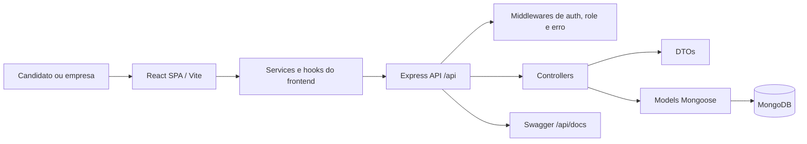

# JobFinder

[](https://github.com/JobFinder-Project/JobFinder/actions/workflows/ci-pipeline.yml)
[](https://github.com/JobFinder-Project/JobFinder/actions/workflows/cd-pipeline.yml)

JobFinder é uma plataforma web para conectar candidatos em busca de oportunidades locais a empresas que precisam divulgar vagas, avaliar inscritos e organizar fluxos de seleção em um único ambiente.

A aplicação atual é desenvolvida na branch `develop` e segue o GitFlow do projeto. A branch `main` ainda pode não representar as mudanças visuais e arquiteturais mais recentes; para consultar a versão mais atual do código, use `develop`.

## Sumário

- [Escopo do Produto](#escopo-do-produto)
- [Funcionalidades Atuais](#funcionalidades-atuais)
- [Arquitetura](#arquitetura)
- [Stack Técnica](#stack-técnica)
- [Estrutura do Repositório](#estrutura-do-repositório)
- [Executando Localmente](#executando-localmente)
- [Variáveis de Ambiente](#variáveis-de-ambiente)
- [Scripts](#scripts)
- [Visão Geral da API](#visão-geral-da-api)
- [Qualidade](#qualidade)
- [Documentação](#documentação)
- [Fluxo de Trabalho](#fluxo-de-trabalho)
- [Contribuidores](#contribuidores)
- [Licença](#licença)

## Escopo do Produto

O JobFinder centraliza a interação entre dois perfis de usuário:

- Candidatos criam e mantêm um perfil profissional, buscam vagas, candidatam-se a oportunidades e acompanham suas candidaturas.
- Empresas criam um perfil institucional, publicam vagas, buscam candidatos, analisam candidaturas e atualizam o andamento dos processos.

O projeto nasceu com foco regional em Itacoatiara, Amazonas, e mantém esse objetivo de empregabilidade local enquanto evolui para uma aplicação full-stack mais clara, modular e preparada para manutenção contínua.

## Funcionalidades Atuais

Para candidatos:

- Cadastro de candidato com dados pessoais, educação, qualificações, cursos, habilidades, idiomas e imagem de perfil.
- Login baseado em sessão com redirecionamento por tipo de usuário.
- Dashboard do candidato com perfil e oportunidades disponíveis.
- Busca de vagas por palavra-chave e área de atuação.
- Visualização de detalhes de vagas.
- Candidatura simplificada, com bloqueio de candidaturas duplicadas.
- Acompanhamento e cancelamento de candidaturas.
- Recuperação de senha por email com token temporário.

Para empresas:

- Cadastro de empresa com CNPJ, contato, biografia e site.
- Dashboard da empresa com vagas publicadas.
- Edição do perfil institucional.
- Criação de vagas com área, requisitos e imagem opcional.
- Gestão de candidaturas com status `Pendente`, `Aceita` e `Rejeitada`.
- Busca de candidatos por nome, educação ou qualificação.

Comportamento de plataforma:

- Rotas protegidas por autenticação e perfil de acesso (`candidato` ou `empresa`).
- Sessões persistidas no MongoDB com `connect-mongo`.
- Validações de CPF, CNPJ, telefone brasileiro, email, URL e campos centrais dos modelos.
- Camada de DTOs para controlar os dados expostos pela API.
- Documentação Swagger servida pelo backend.
- Testes automatizados de backend com Jest, Supertest e MongoDB Memory Server.

## Arquitetura

A aplicação atual é organizada como um monolito modular full-stack: uma SPA em React consome uma API REST em Express, e o backend persiste os dados por meio de modelos Mongoose no MongoDB.



Responsabilidades do backend:

- `routes`: registro das rotas HTTP por domínio.
- `middlewares`: autenticação, autorização, tratamento de rotas inexistentes e erros globais.
- `controllers`: orquestração das requisições e dos fluxos de negócio.
- `models`: schemas Mongoose, índices, validações e regras de persistência.
- `dtos`: formatação das respostas e filtragem de dados sensíveis.
- `docs/swagger`: configuração OpenAPI, schemas e documentação das rotas.

Responsabilidades do frontend:

- `pages`: telas associadas às rotas da aplicação.
- `features`: blocos de interface por domínio, como cards de vagas, cards de candidatos, filtros e modais.
- `components`: layout, navegação, proteção de rotas e componentes reutilizáveis de UI.
- `contexts`: estado global de autenticação.
- `hooks`: acesso reutilizável aos fluxos de candidato, empresa e vagas.
- `services`: camada de comunicação com a API via proxy `/api` do Vite.
- `styles`: estilos globais e base visual da aplicação.

## Stack Técnica

| Camada | Tecnologias |
| --- | --- |
| Frontend | React 18, Vite, React Router, TanStack React Query, CSS Modules, React Icons |
| Backend | Node.js, Express, Mongoose, Express Session, Connect Mongo |
| Banco de dados | MongoDB |
| Autenticação | Cookie de sessão com autorização por perfil |
| Email | Nodemailer com Gmail para recuperação de senha |
| Documentação de API | Swagger / OpenAPI 3 |
| Testes | Jest, Supertest, MongoDB Memory Server, Vitest, React Testing Library, jsdom |
| Ferramentas | ESLint, Prettier, GitHub Actions |

## Estrutura do Repositório

```text
JobFinder/
├── backend/
│   ├── server.js
│   ├── src/
│   │   ├── app.js
│   │   ├── controllers/
│   │   ├── docs/swagger/
│   │   ├── dtos/
│   │   ├── errors/
│   │   ├── middlewares/
│   │   ├── models/
│   │   └── routes/
│   └── tests/
├── frontend/
│   ├── ARCHITECTURE.md
│   ├── vite.config.js
│   └── src/
│       ├── components/
│       ├── contexts/
│       ├── features/
│       ├── hooks/
│       ├── pages/
│       ├── services/
│       └── styles/
├── .github/
│   ├── ISSUE_TEMPLATE/
│   ├── PULL_REQUEST_TEMPLATE.md
│   └── workflows/
├── package.json
└── README.md
```

A documentação extensa de produto e modelagem vive na branch `documents`.

## Executando Localmente

### Pré-requisitos

- Node.js 18 ou superior. A CI atualmente usa Node.js 22.
- npm.
- Uma instância MongoDB local ou hospedada.
- Credenciais de app do Gmail se o fluxo de recuperação de senha for testado localmente.

### Instalação

```bash
git clone git@github.com:JobFinder-Project/JobFinder.git
cd JobFinder
npm run install:all
```

Crie o arquivo `backend/.env` com as variáveis listadas abaixo e inicie o ambiente de desenvolvimento:

```bash
npm run dev
```

URLs locais:

| Serviço | URL |
| --- | --- |
| Frontend | `http://localhost:5173` |
| Backend API | `http://localhost:3000/api` |
| Swagger UI | `http://localhost:3000/api/docs` |

O servidor Vite faz proxy das requisições `/api` para `http://localhost:3000`, acompanhando a camada de services do frontend.

## Variáveis de Ambiente

Crie o arquivo `backend/.env`:

```env
NODE_ENV=development
MONGO_URI=mongodb://localhost:27017/JobFinder
SESSION_SECRET=replace-with-a-local-secret
HOST_FRONTEND=localhost:5173

# Necessário apenas para emails de recuperação de senha
APP_EMAIL=your_email@gmail.com
APP_PASS=your_gmail_app_password
```

Observações:

- `MONGO_URI` é obrigatória fora do ambiente de testes.
- `SESSION_SECRET` é usada pelo `express-session`.
- `HOST_FRONTEND` é usada para gerar links de redefinição de senha.
- `APP_EMAIL` e `APP_PASS` são necessárias ao executar o fluxo de recuperação de senha.

## Scripts

Na raiz do repositório:

| Comando | Descrição |
| --- | --- |
| `npm run dev` | Inicia backend e frontend juntos. |
| `npm run dev:backend` | Inicia a API Express a partir de `backend/`. |
| `npm run dev:frontend` | Inicia o Vite a partir de `frontend/`. |
| `npm run build` | Gera o build do frontend. |
| `npm test` | Executa os testes do backend. |
| `npm run test:backend` | Executa os testes do backend. |
| `npm run test:frontend` | Executa os testes do frontend. |
| `npm run test:all` | Executa testes de backend e frontend em sequência. |
| `npm run install:all` | Instala dependências de backend e frontend. |
| `npm run start` | Inicia o servidor backend. |

Comandos específicos do backend:

| Comando | Descrição |
| --- | --- |
| `npm test` | Executa Jest com MongoDB Memory Server. |
| `npm run lint` | Executa ESLint. |
| `npm run lint:fix` | Executa ESLint com correção automática. |

Comandos específicos do frontend:

| Comando | Descrição |
| --- | --- |
| `npm test` | Executa Vitest em modo run. |
| `npm run test:watch` | Executa Vitest em modo watch. |
| `npm run test:coverage` | Executa Vitest com relatório de cobertura. |

## Visão Geral da API

Todas as rotas da aplicação são montadas sob `/api`.

| Área | Rotas |
| --- | --- |
| Autenticação | `POST /login`, `GET /me`, `GET /logout`, `POST /recuperar_senha`, `POST /redefinir_senha/:token` |
| Candidato | `POST /candidato/cadastrar`, `GET /candidato/dashboard`, `PUT /candidato/editar`, `GET /candidato/candidaturas`, `POST /candidato/vagas/:vagaId`, `DELETE /candidato/candidaturas/delete/:candidaturaId` |
| Empresa | `POST /empresa/cadastrar`, `GET /empresa/dashboard`, `PUT /empresa/editar`, `POST /empresa/vagas/criar`, `GET /empresa/candidaturas`, `PUT /empresa/candidatura/:candidaturaId`, `GET /empresa/candidatos/buscar` |
| Vagas | `GET /vagas`, `GET /areas` |
| Documentação | `GET /docs` |

A API usa cookies de sessão. As rotas internas de candidato e empresa são protegidas por middlewares específicos de perfil depois dos endpoints de cadastro.

## Qualidade

O repositório inclui workflows do GitHub Actions:

- CI em pull requests direcionados para `develop`.
- Job de testes do backend com Node.js 22 e `npm test`.
- Job de testes do frontend com Node.js 22 e `npm test`.
- Job de build do frontend com Node.js 22 e `npm run build`.
- CD em pushes para `main`, atualmente configurado para acionar um deploy hook do Render.

A suíte de testes do backend cobre autenticação, permissões por perfil, vagas, candidaturas, recuperação de senha, tratamento de erros e validações Mongoose. A suíte do frontend cobre contexto de autenticação, guards de rota, services, componentes principais e renderização de páginas críticas.

A meta inicial de cobertura do frontend está configurada em `frontend/vite.config.js` com 35% para linhas e statements, 30% para funções e 45% para branches.

## 📄 Documentação

A estratégia de documentação está separada de forma intencional:

- `develop`: código atual da aplicação e este README.
- `documents`: requisitos, personas, histórias de usuário, diagramas UML e artefatos de modelagem.
- `frontend/ARCHITECTURE.md`: estrutura do frontend, convenções de nomenclatura, CSS Modules, services, hooks e componentes.
- `backend/src/docs/swagger`: fonte da documentação da API servida pelo Swagger UI.

Para inspecionar a documentação sem trocar de branch:

```bash
git ls-tree -r --name-only origin/documents
```

Para trabalhar diretamente na documentação:

```bash
git switch documents
```

## Fluxo de Trabalho

O projeto segue um processo inspirado em GitFlow:

- `develop` recebe o desenvolvimento ativo e as refatorações visuais/arquiteturais.
- Novas features devem partir de `develop`.
- Pull requests devem mirar `develop` e seguir o template do repositório.
- Branches de release são usadas para estabilização e versionamento.
- `main` é a linha de produção/deploy e pode ficar atrás de `develop` enquanto grandes mudanças estão sendo preparadas.


## 👥 Equipe Principal e Colaboradores Chave

Este projeto é mantido e desenvolvido pelos seguintes autores:

*   **Felipe William** ([@FelipeWilliam-dev](https://github.com/FelipeWilliam-dev))
*   **João Carlos** ([@JoaoCarlos22](https://github.com/JoaoCarlos22))
*   **Reyner Alegria** ([@reyneralegria13](https://github.com/reyneralegria13))

## 🤝 Contribuições 

Este projeto já contou com a contribuições das seguintes pessoas:

*   **João Paulo** ([@joaoreboucas05](https://github.com/joaoreboucas05))
*   **Mayro Sa** ([@mayro5a](https://github.com/mayro5a))
*   **Calil Lima** ([@Kallicco](https://github.com/Kallicco))
*   **Nicolas Oliveira** ([@NicolasOliveira72](https://github.com/NicolasOliveira72))


## 📜 Licença

O manifesto raiz do projeto declara a licença MIT. Antes de uma distribuição externa, mantenha os metadados de licença e a documentação do repositório alinhados.
