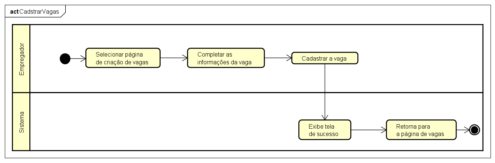
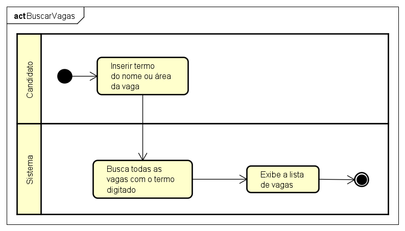
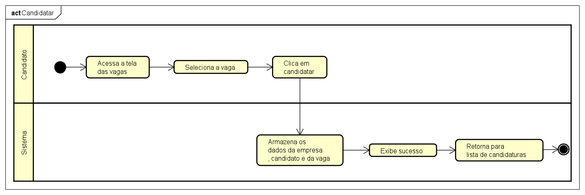

# Diagramas de Atividade - JobFinder

Este documento apresenta e explica os principais diagramas de atividade do sistema JobFinder, detalhando o fluxo de cada funcionalidade.

---

## Efetuar Login

O fluxo de login inicia com o usuário acessando a tela de autenticação. Ele informa e-mail e senha, e o sistema valida as credenciais. Se forem válidas, o usuário é direcionado ao painel correspondente (candidato ou empregador). Caso contrário, uma mensagem de erro é exibida e o usuário pode tentar novamente.

---

## Realizar Cadastro

O usuário escolhe entre cadastrar-se como candidato ou empregador. Após preencher os dados obrigatórios (nome, e-mail, senha, etc.), o sistema valida as informações. Se tudo estiver correto, o cadastro é concluído e o usuário pode acessar o sistema. Em caso de erro, o sistema solicita correção dos dados.

---

## Verificar Vagas

O candidato acessa a área de vagas, onde o sistema exibe todas as oportunidades disponíveis. Ao selecionar uma vaga, os detalhes são apresentados, permitindo análise dos requisitos e informações da empresa.

---

## Cadastrar Vagas

O empregador acessa o painel de vagas e opta por cadastrar uma nova oportunidade. Ele preenche os dados da vaga (título, área, requisitos, imagem). O sistema valida as informações e, se estiverem corretas, publica a vaga para candidatos visualizarem e se candidatarem.

---

## Buscar Vagas

O candidato utiliza filtros ou barra de busca para encontrar vagas de interesse. O sistema processa os critérios e retorna uma lista de vagas correspondentes. O usuário pode então visualizar detalhes ou se candidatar diretamente.

---

## Realizar Candidatura

O candidato seleciona uma vaga e opta por se candidatar. O sistema verifica se o candidato já está inscrito e, caso não esteja, registra a candidatura.

