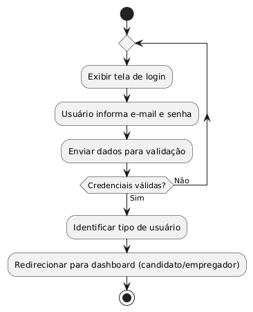
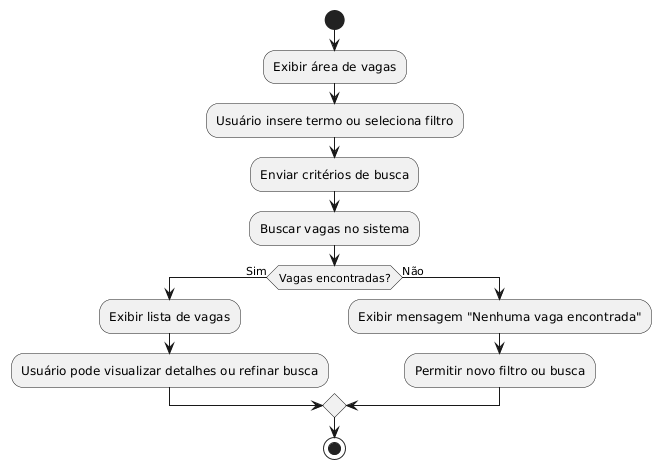
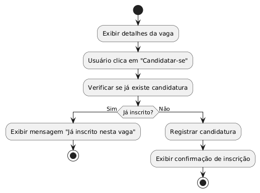
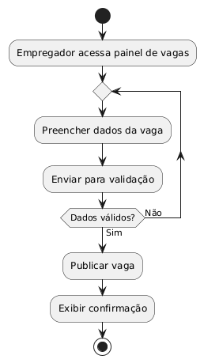
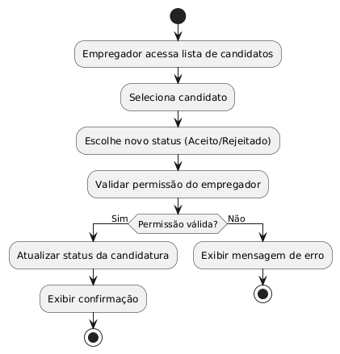

# Diagramas de Atividade - JobFinder

Este documento apresenta e explica os principais diagramas de atividade do sistema JobFinder, detalhando o fluxo de cada funcionalidade.

## Autenticação do Usuário

O fluxo de autenticação inicia com o usuário acessando a tela de login, informando e-mail e senha. O sistema valida as credenciais. Se forem válidas, direciona o usuário ao painel correspondente; caso contrário, exibe mensagem de erro e permite nova tentativa.

<!-- @startuml
start
repeat
	:Exibir tela de login;
	:Usuário informa e-mail e senha;
	:Enviar dados para validação;
repeat while (Credenciais válidas?) is (Não) not (Sim)
:Identificar tipo de usuário;
:Redirecionar para painel (candidato/empregador);
stop
@enduml -->

---

## Buscar Vagas

O candidato acessa a área de vagas, utiliza filtros ou barra de busca para encontrar oportunidades. O sistema retorna a lista de vagas correspondentes. O usuário pode visualizar detalhes ou refinar a busca.

<!-- @startuml
start
:Exibir área de vagas;
:Usuário insere termo ou seleciona filtro;
:Enviar critérios de busca;
:Buscar vagas no sistema;
if (Vagas encontradas?) then (Sim)
	:Exibir lista de vagas;
	:Usuário pode visualizar detalhes ou refinar busca;
else (Não)
	:Exibir mensagem "Nenhuma vaga encontrada";
	:Permitir novo filtro ou busca;
endif
stop
@enduml -->

---

## Candidatar-se a Vaga

O candidato seleciona uma vaga, visualiza os detalhes e opta por se candidatar. O sistema verifica se já existe candidatura. Se não houver, registra a inscrição; caso contrário, exibe mensagem de erro.

<!-- @startuml
start
:Exibir detalhes da vaga;
:Usuário clica em "Candidatar-se";
:Verificar se já existe candidatura;
if (Já inscrito?) then (Sim)
	:Exibir mensagem "Já inscrito nesta vaga";
	stop
else (Não)
	:Registrar candidatura;
	:Exibir confirmação de inscrição;
	stop
endif
@enduml -->

---

## Publicar Vaga

O empregador acessa o painel de vagas, preenche os dados da nova vaga e envia para o sistema. O sistema valida as informações. Se estiverem corretas, publica a vaga; caso contrário, solicita correção dos dados.

<!-- @startuml
start
:Empregador acessa painel de vagas;
repeat
	:Preencher dados da vaga;
	:Enviar para validação;
repeat while (Dados válidos?) is (Não) not (Sim)
:Publicar vaga;
:Exibir confirmação;
stop
@enduml -->

---

## Alterar Status de uma Candidatura

O empregador acessa a lista de candidatos de uma vaga, seleciona um candidato e altera o status (Aceito/Rejeitado). O sistema valida a permissão e executa a alteração, ou exibe erro se não autorizado.

<!-- @startuml
start
:Empregador acessa lista de candidatos;
:Seleciona candidato;
:Escolhe novo status (Aceito/Rejeitado);
:Validar permissão do empregador;
if (Permissão válida?) then (Sim)
	:Atualizar status da candidatura;
	:Exibir confirmação;
	stop
else (Não)
	:Exibir mensagem de erro;
	stop
endif
@enduml -->

<!-- ---

## Efetuar Login

O fluxo de login inicia com o usuário acessando a tela de autenticação. Ele informa e-mail e senha, e o sistema valida as credenciais. Se forem válidas, o usuário é direcionado ao painel correspondente (candidato ou empregador). Caso contrário, uma mensagem de erro é exibida e o usuário pode tentar novamente.

---

## Realizar Cadastro

O usuário escolhe entre cadastrar-se como candidato ou empregador. Após preencher os dados obrigatórios (nome, e-mail, senha, etc.), o sistema valida as informações. Se tudo estiver correto, o cadastro é concluído e o usuário pode acessar o sistema. Em caso de erro, o sistema solicita correção dos dados.

---

## Verificar Vagas

O candidato acessa a área de vagas, onde o sistema exibe todas as oportunidades disponíveis. Ao selecionar uma vaga, os detalhes são apresentados, permitindo análise dos requisitos e informações da empresa.

---

## Cadastrar Vagas

O empregador acessa o painel de vagas e opta por cadastrar uma nova oportunidade. Ele preenche os dados da vaga (título, área, requisitos, imagem). O sistema valida as informações e, se estiverem corretas, publica a vaga para candidatos visualizarem e se candidatarem.

---

## Buscar Vagas

O candidato utiliza filtros ou barra de busca para encontrar vagas de interesse. O sistema processa os critérios e retorna uma lista de vagas correspondentes. O usuário pode então visualizar detalhes ou se candidatar diretamente.

---

## Realizar Candidatura

O candidato seleciona uma vaga e opta por se candidatar. O sistema verifica se o candidato já está inscrito e, caso não esteja, registra a candidatura.

 -->
