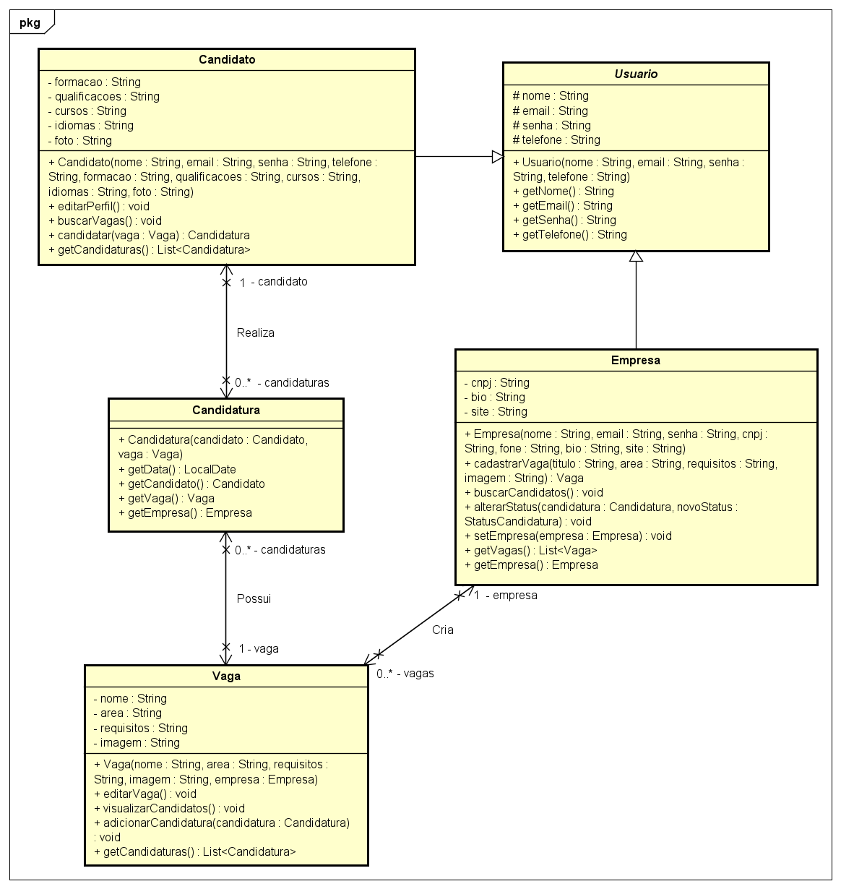

# Diagrama de Classes - JobFinder

Este documento explica o diagrama de classes do sistema JobFinder, detalhando as principais classes, atributos, métodos e os relacionamentos entre elas.

---

## Visão Geral

O diagrama de classes representa a estrutura estática do sistema JobFinder, modelando entidades centrais como **Candidato**, **Empregador**, **Vaga**, **Candidatura** e **Empresa**. Ele mostra como essas classes se relacionam e quais informações e operações cada uma encapsula.

---

### Principais Classes

- **Candidato**
  - Representa o usuário que busca vagas.
  - Atributos: nome, e-mail, telefone, formação, qualificações, cursos, idiomas, foto.
  - Métodos: editarPerfil(), buscarVagas(), candidatar().
  - Relacionamento: Pode se candidatar a várias vagas (associação com Candidatura).

- **Empregador**
  - Representa o usuário responsável por publicar vagas.
  - Atributos: nome, e-mail, CNPJ, telefone, bio, site.
  - Métodos: cadastrarVaga(), buscarCandidatos(), alterarStatus().
  - Relacionamento: Pode publicar várias vagas (associação com Vaga).

- **Empresa**
  - Representa os dados institucionais da empresa.
  - Atributos: nome, CNPJ, contato, bio, site.
  - Relacionamento: Associada ao Empregador.

- **Vaga**
  - Representa uma oportunidade de emprego.
  - Atributos: título, área, requisitos, imagem, status.
  - Métodos: editarVaga(), visualizarCandidatos().
  - Relacionamento: Publicada por um Empregador; pode ter várias Candidaturas.

- **Candidatura**
  - Representa a inscrição de um candidato em uma vaga.
  - Atributos: data, status (Pendente, Aceito, Rejeitado).
  - Relacionamento: Associação entre Candidato e Vaga.

---

### Relacionamentos

- **Associação**
  - Candidato ↔ Candidatura: Um candidato pode ter várias candidaturas.
  - Vaga ↔ Candidatura: Uma vaga pode receber várias candidaturas.
  - Empregador ↔ Vaga: Um empregador pode publicar várias vagas.
  - Empregador ↔ Empresa: Um empregador está vinculado a uma empresa.

- **Dependência**
  - Candidatura depende de Candidato e Vaga para existir.

- **Herança**
  - Caso haja classes genéricas de usuário, Candidato e Empregador podem herdar de uma classe base Usuário.

---

### Resumo dos Fluxos

- O **Candidato** cadastra e edita seu perfil, busca vagas e se candidata.
- O **Empregador** cadastra a empresa, publica vagas e gerencia candidaturas.
- A **Empresa** centraliza os dados institucionais.
- A **Vaga** é criada pelo empregador e recebe candidaturas.
- A **Candidatura** conecta candidato e vaga, permitindo o acompanhamento do status.

---

### Diagrama Geral

O diagrama visualiza essas classes e seus relacionamentos, facilitando o entendimento da estrutura de dados e das operações do sistema.
