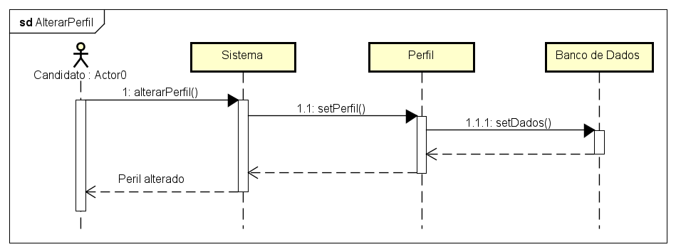
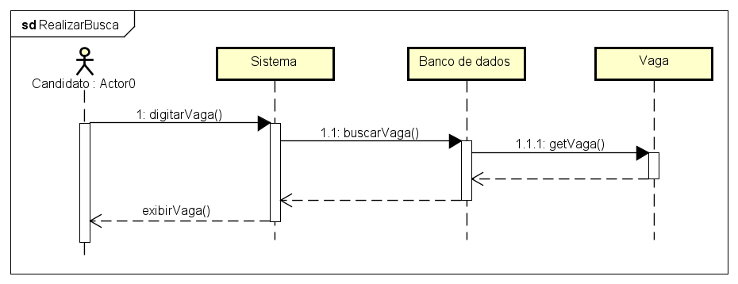
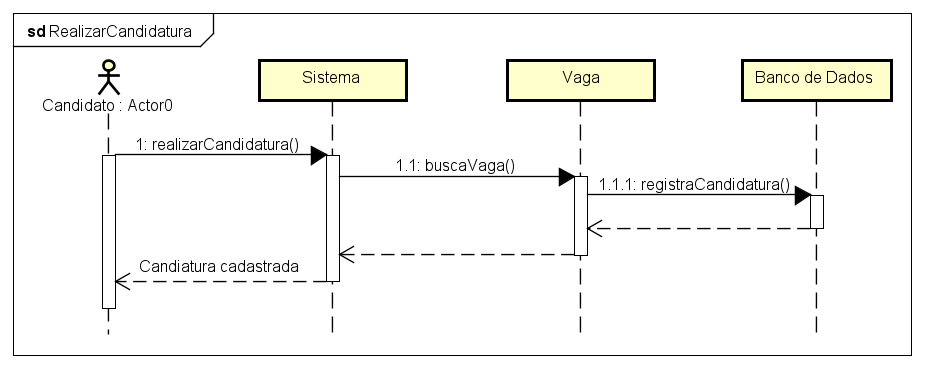
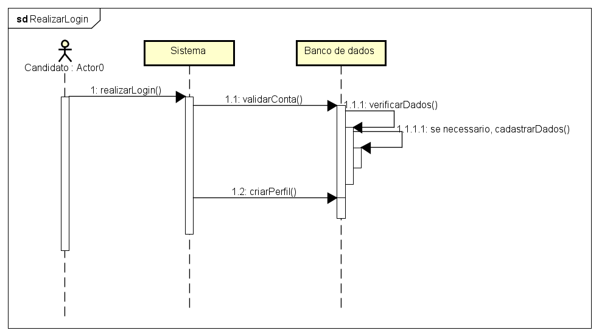

# Diagramas de Sequência — Candidato

Este documento reúne e explica os principais diagramas de sequência relacionados às ações do candidato no sistema JobFinder.

---

## 1. Alterar Perfil

O diagrama mostra o fluxo para o candidato atualizar suas informações pessoais, experiências, cursos e foto de perfil. O candidato acessa o painel, solicita a alteração, o sistema valida os dados e atualiza o perfil.

---

## 2. Realizar Busca

Representa o processo de busca de vagas pelo candidato. O usuário insere termos ou seleciona áreas, o sistema filtra e retorna as vagas correspondentes, permitindo ao candidato visualizar detalhes.

---

## 3. Realizar Candidatura

Mostra o fluxo de candidatura a uma vaga. O candidato seleciona uma vaga, visualiza os requisitos, confirma a inscrição e o sistema registra a candidatura, atualizando o status.

---

## 4. Realizar Login

Descreve o processo de autenticação do candidato. O usuário informa e-mail e senha, o sistema valida as credenciais e direciona ao painel do candidato.

