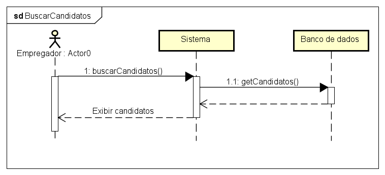
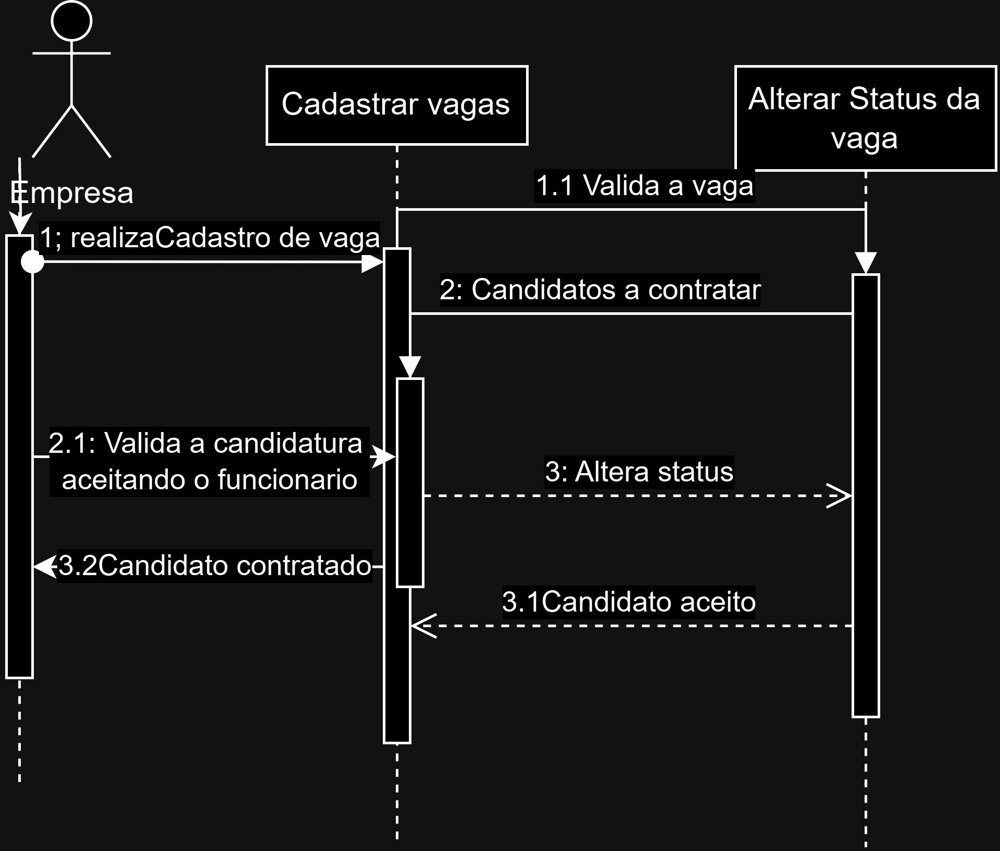
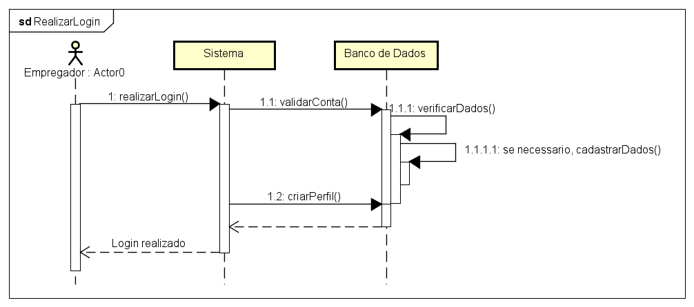

# Diagramas de Sequência — Empregador

Este documento centraliza e explica os principais diagramas de sequência das ações do empregador no JobFinder.

---

## 1. Buscar Candidatos

O diagrama detalha como o empregador pesquisa candidatos na plataforma. O empregador utiliza filtros (formação, qualificações), o sistema retorna os candidatos correspondentes e permite visualizar seus perfis.

---

## 2. Cadastrar Vagas

Mostra o fluxo para o empregador cadastrar uma nova vaga. O empregador preenche os dados da vaga, o sistema valida e registra a vaga, tornando-a disponível para candidatos.

---

## 3. Realizar Login

Descreve o processo de autenticação do empregador. O usuário informa e-mail e senha, o sistema valida as credenciais e direciona ao painel da empresa.

