# Diagramas de Sequência — JobFinder

Este documento reúne e explica os principais diagramas de sequência relacionados aos fluxos de interação no sistema JobFinder.

---

## Visão Geral dos Diagramas de Sequência

**Atores**: representam usuários externos (ex.: Candidato, Empregador, Usuário) que iniciam as ações.
**Frontend**: interface do sistema, responsável por coletar dados, exibir telas e enviar requisições.
**Backend**: camada de negócio que valida regras, autentica usuários e coordena operações.
**Banco de Dados**: armazenamento persistente das informações (usuários, vagas, candidaturas).

**Comunicação**: o ator interage com o **Frontend**, que envia requisições ao **Backend**. O **Backend** consulta/atualiza o **Banco de Dados** e retorna a resposta ao **Frontend**, que então apresenta o resultado ao ator. Os fluxos incluem caminhos de sucesso e erro (ex.: credenciais inválidas, dados inconsistentes).

---

## RF01 — Login do Usuário

Este RF abrange o fluxo de login do sistema. O diagrama a seguir detalha esse cenário, mostrando como o sistema garante segurança e usabilidade.

### Login

O processo de login envolve a inserção de credenciais pelo usuário, validação pelo backend e resposta adequada. O sistema deve garantir que apenas usuários autenticados possam acessar as funcionalidades internas, conforme a regra de negócio RN01.

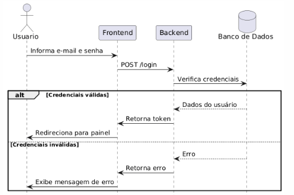

* **Fluxo do diagrama:**

1. O **usuário** insere e-mail e senha na tela de login.
2. O **frontend** envia uma requisição de autenticação ao **backend**.
3. O **backend** valida as credenciais no **banco de dados**.
4. Se as credenciais forem válidas, o **usuário** é autenticado e direcionado ao painel.
5. Se as credenciais forem inválidas, uma mensagem de erro é exibida.

---

## RF02 — Gestão de Perfil do Candidato

Este RF trata do ciclo de vida do perfil do candidato: cadastro, visualização e edição. Cada diagrama detalha um aspecto do gerenciamento do perfil.

### Cadastro de Perfil

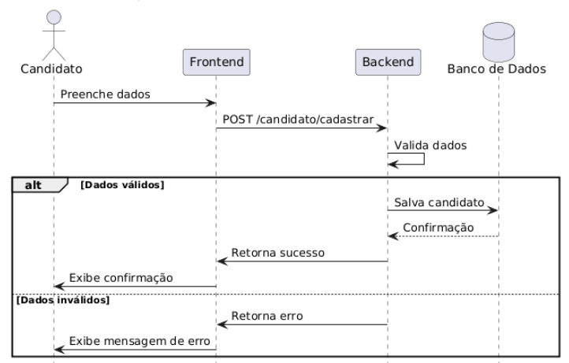

* **Fluxo do diagrama:**
1. O **candidato** preenche o formulário de cadastro.
2. O **frontend** envia os dados para o **backend**.
3. O **backend** valida as informações e, se corretas, salva o perfil no **banco de dados**.
4. Se houver erros de validação, o **backend** retorna mensagens específicas para o **frontend**, que as exibe ao **candidato**.

### Visualização de Perfil

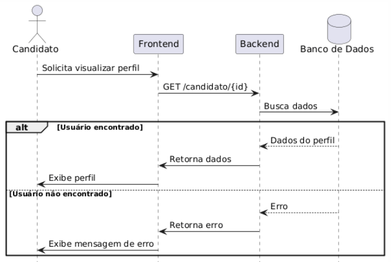

* **Fluxo do diagrama:**
1. O **candidato** acessa a tela de perfil.
2. O **frontend** solicita os dados do perfil ao **backend**.
3. O **backend** busca os dados no **banco de dados** e retorna ao **frontend**.
4. O **frontend** exibe os dados ao **candidato**.
5. Se o perfil não existir, o **backend** retorna um erro, e o **frontend** informa o usuário.

### Edição de Perfil

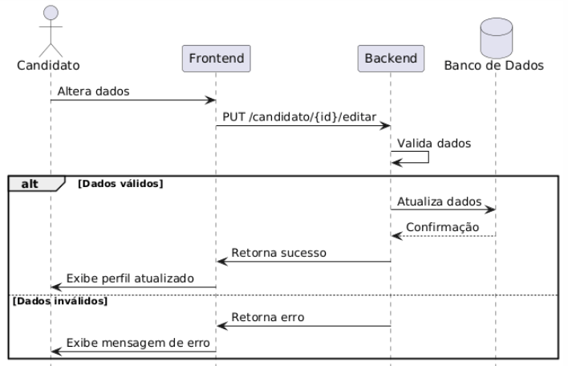

* **Fluxo do diagrama:**
1. O **candidato** acessa a opção de edição de perfil.
2. O **frontend** exibe os dados atuais do perfil para edição.
3. O **candidato** altera os dados e envia a atualização.
4. O **backend** valida as informações e, se corretas, atualiza o perfil no **banco de dados**.
5. Se houver erros de validação, o **backend** retorna mensagens específicas para o **frontend**, que as exibe ao **candidato**.

Esses fluxos permitem ao candidato manter seu perfil sempre atualizado e completo, fundamental para o sucesso na busca de vagas.

---

## RF03 — Gestão de Perfil da Empresa

Este RF contempla o cadastro e a manutenção do perfil institucional do empregador.

### Cadastro de Empresa

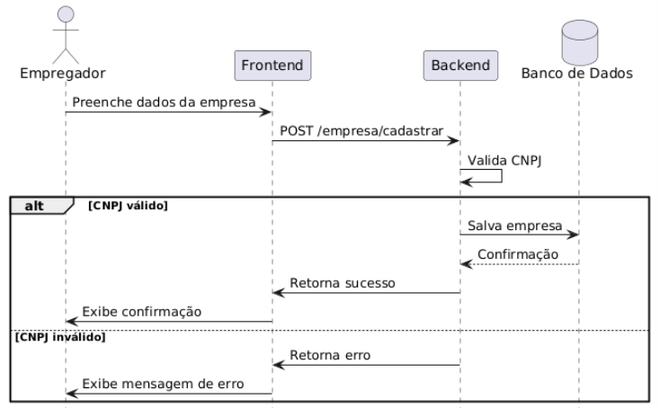

* **Fluxo do diagrama:**
1. O **empregador** preenche o formulário de cadastro da empresa.
2. O **frontend** envia os dados para o **backend**.
3. O **backend** valida as informações, incluindo a autenticidade do CNPJ (RNF03), e, se corretas, salva o perfil no **banco de dados**.
4. Se houver erros de validação, o **backend** retorna mensagens específicas para o **frontend**, que as exibe ao **empregador**.

### Gestão de Perfil Institucional

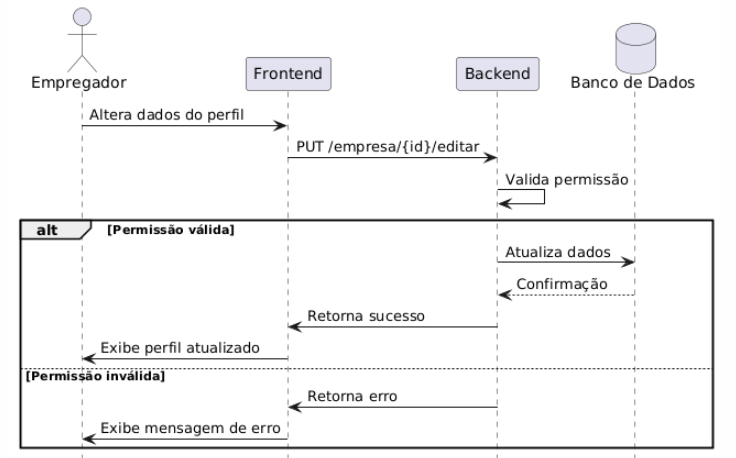

* **Fluxo do diagrama:**
1. O **empregador** acessa a opção de edição do perfil da empresa.
2. O **frontend** exibe os dados atuais do perfil para edição.
3. O **empregador** altera os dados e envia a atualização.
4. O **backend** valida as informações e, se corretas, atualiza o perfil no **banco de dados**.
5. Se houver erros de validação, o **backend** retorna mensagens específicas para o **frontend**, que as exibe ao **empregador**.

Esses fluxos garantem que apenas empregadores autorizados possam cadastrar e manter informações institucionais corretas.

---

## RF04 — Busca e Candidatura a Vagas

Este RF cobre a busca de vagas e o processo de candidatura do candidato.

### Buscar Vagas

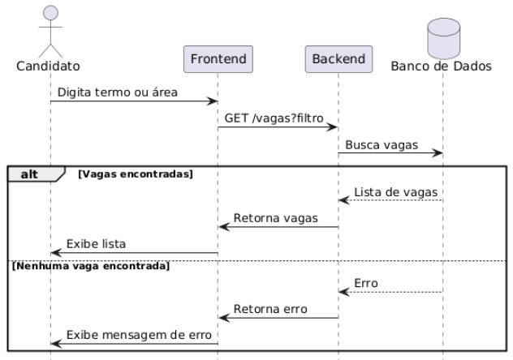

* **Fluxo do diagrama:**
1. O **candidato** acessa a tela de busca de vagas.
2. O **frontend** solicita a lista de vagas ao **backend**.
3. O **backend** busca as vagas no **banco de dados** e retorna ao **frontend**.
4. O **frontend** exibe as vagas ao **candidato**.
5. Se não houver vagas disponíveis, o **backend** retorna uma mensagem informando a ausência de resultados, e o **frontend** a exibe ao **candidato**.

### Candidatar-se a Vaga

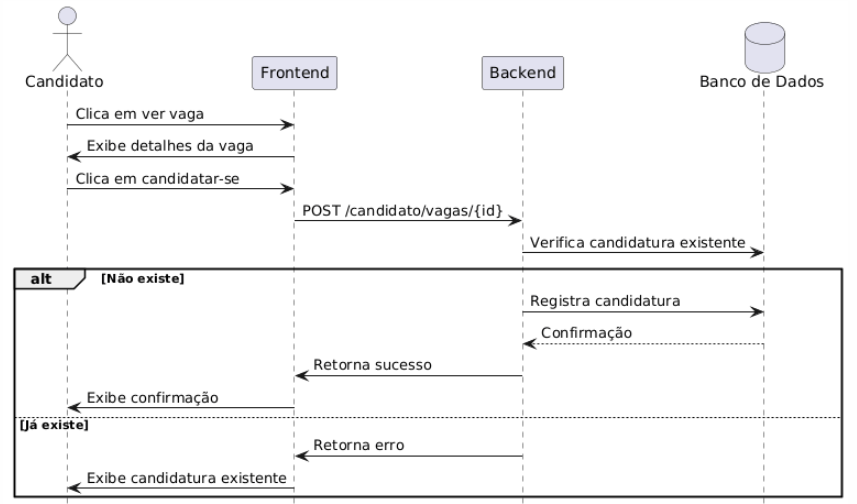

* **Fluxo do diagrama:**
1. O **candidato** seleciona uma vaga e envia a candidatura.
2. O **backend** verifica se já existe uma candidatura para a vaga.
3. Se não houver candidatura, o **backend** registra a nova candidatura no **banco de dados**.
4. Se já existir uma candidatura, o **backend** retorna um erro, e o **frontend** informa o **candidato**.

Esses fluxos permitem ao candidato encontrar oportunidades e se candidatar de forma eficiente, evitando duplicidade de inscrições.

---

## RF05 — Gestão de Vagas pelo Empregador

Este RF abrange todas as ações do empregador sobre as vagas: publicação, visualização de candidatos e alteração de status.

### Publicar Vaga

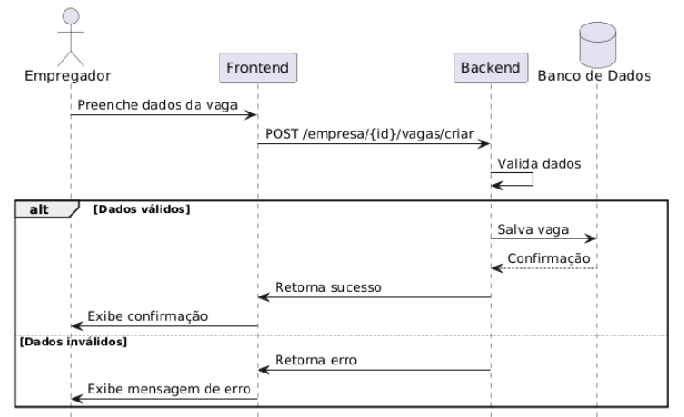

* **Fluxo do diagrama:**
1. O **empregador** acessa a opção de publicar uma nova vaga.
2. O **frontend** exibe o formulário de cadastro da vaga.
3. O **empregador** preenche os dados da vaga e envia.
4. O **backend** valida as informações e, se corretas, publica a vaga no **banco de dados**.
5. Se houver erros de validação, o **backend** retorna mensagens específicas para o **frontend**, que as exibe ao **empregador**.

### Visualizar Candidatos Inscritos

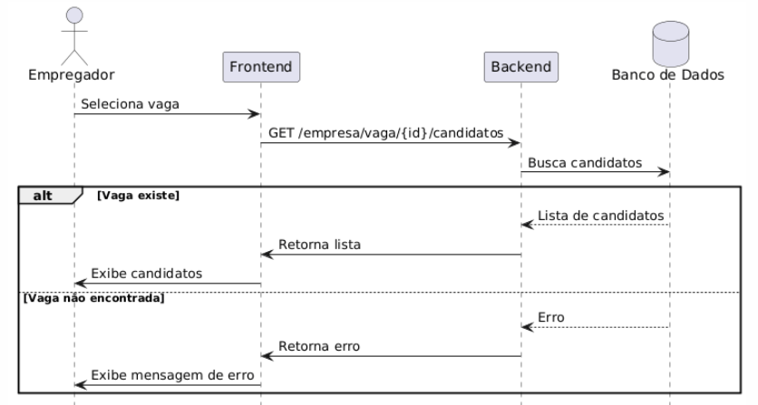

* **Fluxo do diagrama:**
1. O **empregador** seleciona uma vaga para visualizar os candidatos inscritos.
2. O **backend** busca os candidatos no **banco de dados** e retorna ao **frontend**.
3. O **frontend** exibe os candidatos ao **empregador**.
4. Se a vaga não existir, o **backend** retorna um erro, e o **frontend** informa o **empregador**.

### Alterar Status de Candidatura

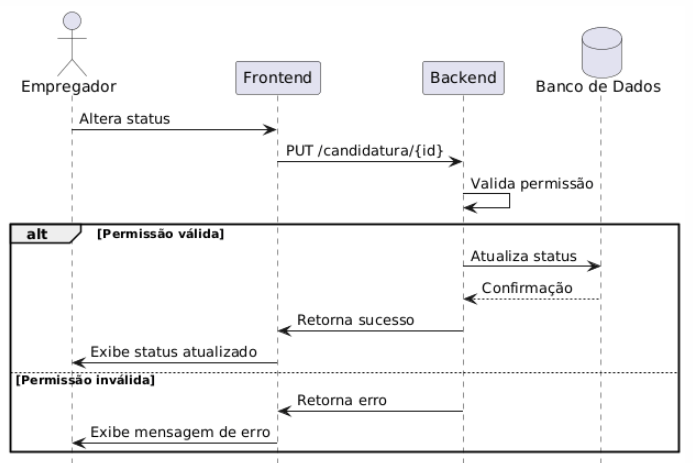

* **Fluxo do diagrama:**
1. O **empregador** seleciona uma candidatura para alterar o status.
2. O **backend** verifica se o **empregador** tem permissão para alterar o status.
3. Se autorizado, o **backend** atualiza o status da candidatura no **banco de dados**.
4. Se não autorizado, o **backend** retorna um erro, e o **frontend** informa o **empregador**.

Esses fluxos permitem ao empregador gerenciar todo o ciclo de vida das vagas e candidaturas.

---

## RF06 — Filtro de Vagas

Este RF permite ao candidato filtrar as vagas por área de atuação ou palavras-chave, facilitando a busca por oportunidades relevantes.

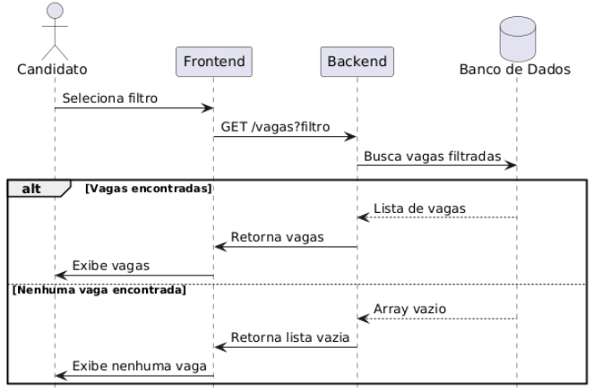

* **Fluxo do diagrama:**
1. O **candidato** insere os critérios de filtro (área de atuação ou palavras-chave).
2. O **frontend** envia a requisição de filtro ao **backend**.
3. O **backend** busca as vagas no **banco de dados** de acordo com os critérios e retorna ao **frontend**.
4. O **frontend** exibe as vagas filtradas ao **candidato**.
5. Se não houver vagas compatíveis, o **backend** retorna uma mensagem informando a ausência de resultados, e o **frontend** a exibe ao **candidato**.

---

## RF07 — Filtro e Visualização de Candidatos

Este RF permite ao empregador filtrar candidatos por qualificações e experiências, além de visualizar o perfil completo de cada um.

### Filtrar Candidatos

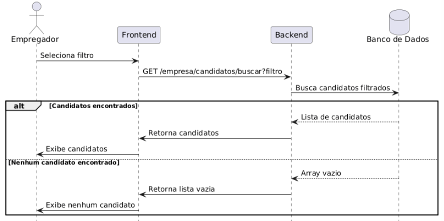

* **Fluxo do diagrama:**
1. O **empregador** insere os critérios de filtro (qualificações, experiências, etc).
2. O **frontend** envia a requisição de filtro ao **backend**.
3. O **backend** busca os candidatos no **banco de dados** de acordo com os critérios e retorna ao **frontend**.
4. O **frontend** exibe os candidatos filtrados ao **empregador**.
5. Se não houver candidatos compatíveis, o **backend** retorna uma mensagem informando a ausência de resultados, e o **frontend** a exibe ao **empregador**.

### Visualizar Perfil de Candidato

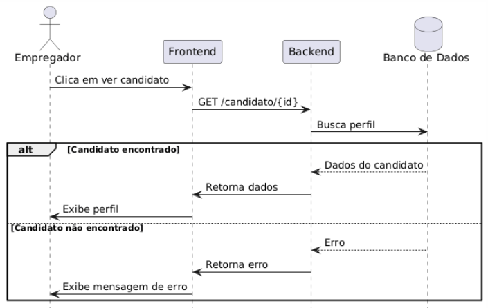

* **Fluxo do diagrama:**
1. O **empregador** seleciona um candidato para visualizar o perfil completo.
2. O **backend** busca as informações do candidato no **banco de dados** e retorna ao **frontend**.
3. O **frontend** exibe o perfil completo do candidato ao **empregador**.
4. Se o candidato não existir, o **backend** retorna um erro, e o **frontend** informa o **empregador**.

---

## RF08 — Dashboard do Empregador

Este RF contempla o painel centralizado para que empregadores gerenciem suas vagas e candidatos inscritos, garantindo uma visão geral eficiente e organizada.

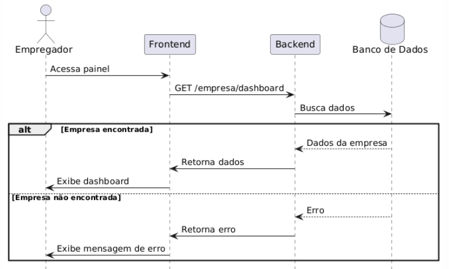

* **Fluxo do diagrama:**
1. O **empregador** acessa o dashboard.
2. O **backend** busca as informações relevantes no **banco de dados** e retorna ao **frontend**.
3. O **frontend** exibe as informações consolidadas ao **empregador**.
4. Se a empresa não existir, o **backend** retorna um erro, e o **frontend** informa o **empregador**.

---

## RF09 — Visualização da Página Pública da Empresa (futura)

Este RF permite que candidatos visualizem a página pública das empresas, contendo informações institucionais e vagas ativas, facilitando a decisão de candidatura.

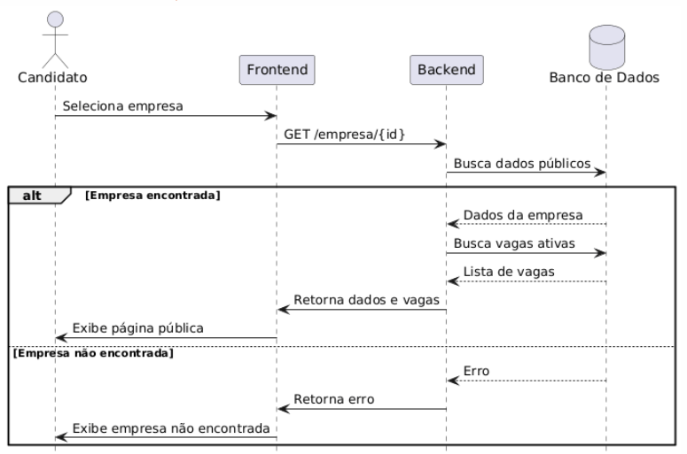

* **Fluxo do diagrama:**
1. O **candidato** seleciona uma empresa para visualizar a página pública.
2. O **backend** busca as informações da empresa no **banco de dados** e retorna ao **frontend**.
3. O **frontend** exibe a página pública da empresa ao **candidato**.
4. Se a empresa não existir, o **backend** retorna um erro, e o **frontend** informa o **candidato**.

---

## RF10 — Canal de Suporte (futura)

Este RF contempla um canal de suporte para que usuários relatem problemas ou tirem dúvidas técnicas, garantindo uma comunicação eficiente entre usuários e equipe de suporte.

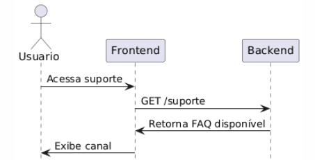

* **Fluxo do diagrama:**
1. O **usuário** acessa o canal de suporte.
2. O **frontend** envia a solicitação ao **backend**.
3. O **backend** processa a solicitação e retorna a resposta ao **frontend**.
4. O **frontend** exibe a resposta ao **usuário**.

---

## RF11 — Interação entre Candidatos (futura)

Este RF permite a interação entre candidatos para troca de experiências e informações profissionais, promovendo uma comunidade colaborativa dentro da plataforma.

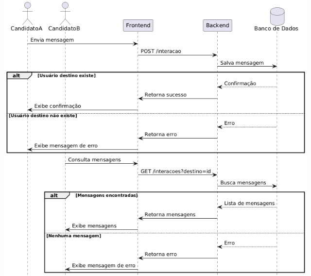

* **Fluxo do diagrama:**
1. O **candidato** acessa a funcionalidade de interação.
2. O **frontend** envia a solicitação de interação ao **backend**.
3. O **backend** processa a solicitação e retorna a resposta ao **frontend**.
4. O **frontend** exibe a resposta ao **candidato**.
5. Se o usuário não existir, o **backend** retorna um erro, e o **frontend** informa o **candidato**.
6. O outro candidato recebe a notificação da interação e pode responder, seguindo o mesmo fluxo.