# DIAGRAMAS DE CASOS DE USO

Este documento apresenta os diagramas de caso de uso do JobFinder mapeados diretamente aos requisitos funcionais atuais (RF01 a RF11), conforme o documento de requisitos.

---

## RF01 — Login na aplicação

### Diagrama: Login de Empregador (visão simples)

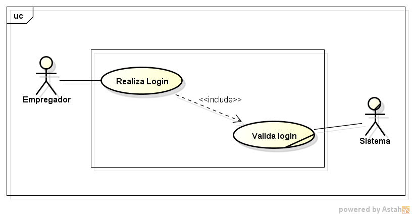

- **Objetivo**: autenticar empregador no sistema.
- **Ator principal**: Empregador.
- **Pré-condição**: empregador cadastrado e ativo.
- **Fluxo principal**: informar credenciais -> validar acesso -> entrar no sistema.
- **Pós-condição**: sessão autenticada criada.

### Diagrama: Login de Empregador (visão complexa)

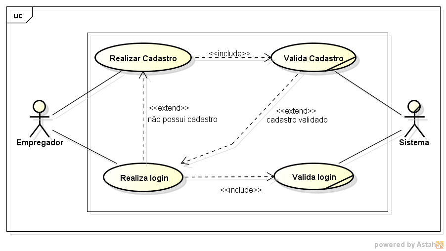

- **Objetivo**: detalhar o login com dependência de cadastro prévio.
- **Ator principal**: Empregador.
- **Pré-condição**: conta existente (ou cadastro realizado no fluxo).
- **Fluxo principal**: cadastro (quando necessário) -> autenticação -> redirecionamento.
- **Pós-condição**: empregador autenticado e apto a acessar funcionalidades internas.

### Diagrama: Login de Candidato (visão simples)

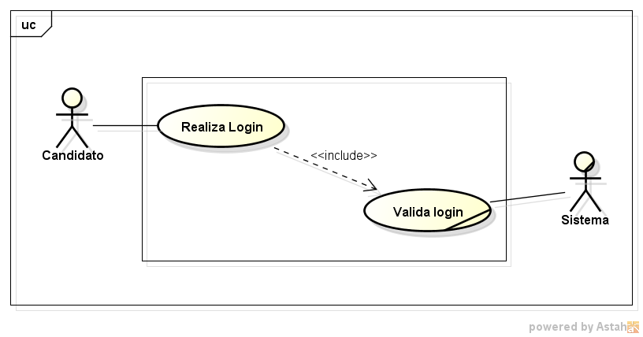

- **Objetivo**: autenticar candidato no sistema.
- **Ator principal**: Candidato.
- **Pré-condição**: candidato cadastrado.
- **Fluxo principal**: informar credenciais -> validar acesso.
- **Pós-condição**: sessão de candidato ativa.

### Diagrama: Login de Candidato (visão complexa)

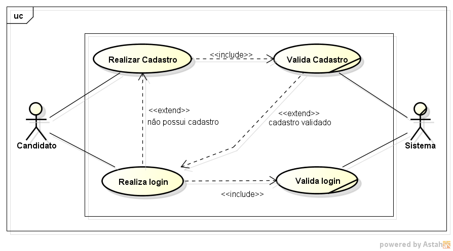

- **Objetivo**: detalhar o caminho completo de cadastro + login.
- **Ator principal**: Candidato.
- **Pré-condição**: dados válidos para registro/autenticação.
- **Fluxo principal**: cadastro (se necessário) -> login -> acesso interno.
- **Pós-condição**: candidato autenticado no sistema.

---

## RF02 — Cadastro, visualização e edição de perfil do candidato

### Diagrama: Cadastro de Candidato

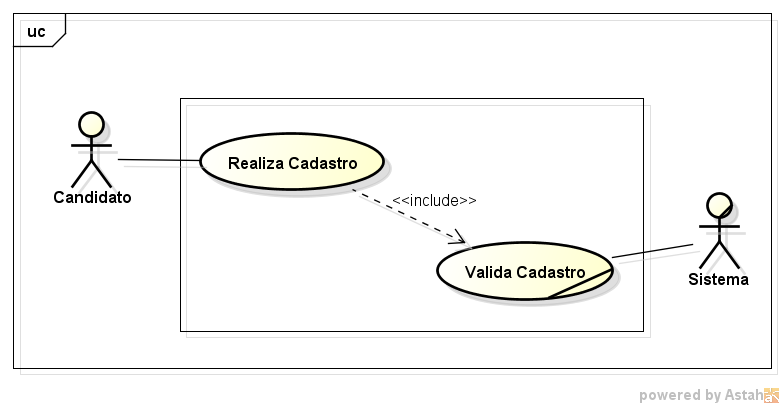

- **Objetivo**: registrar novo candidato na plataforma.
- **Ator principal**: Candidato.
- **Pré-condição**: candidato não possuir cadastro ativo com os mesmos dados críticos.
- **Fluxo principal**: preencher dados -> validar -> concluir cadastro.
- **Pós-condição**: perfil de candidato criado.

### Diagrama: Perfil do Candidato (visão simples)

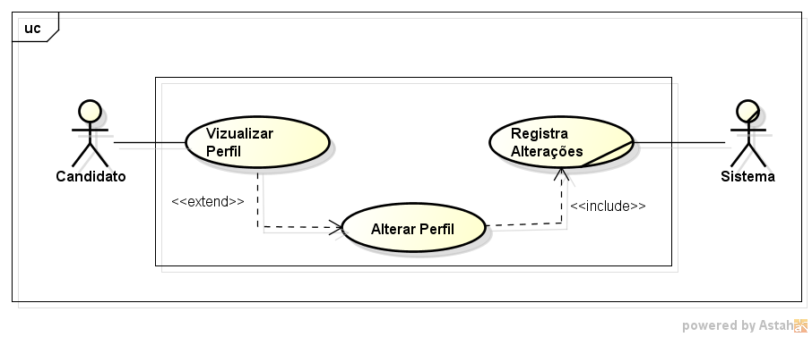

- **Objetivo**: visualizar e alterar informações de perfil profissional.
- **Ator principal**: Candidato.
- **Pré-condição**: candidato autenticado.
- **Fluxo principal**: acessar perfil -> editar informações -> salvar alterações.
- **Pós-condição**: perfil atualizado.

### Diagrama: Perfil do Candidato (visão complexa)

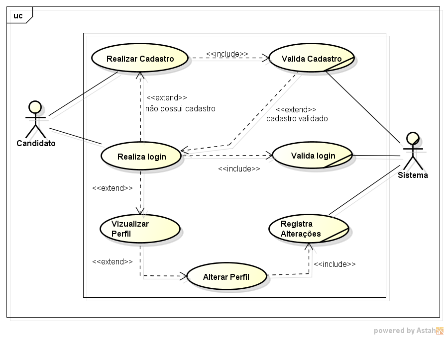

- **Objetivo**: explicitar dependências de autenticação e validação no gerenciamento do perfil.
- **Ator principal**: Candidato.
- **Pré-condição**: login válido.
- **Fluxo principal**: login -> acesso ao perfil -> edição -> confirmação.
- **Pós-condição**: dados persistidos e exibidos ao usuário.

---

## RF03 — Cadastro da empresa e gestão do perfil institucional do empregador

### Diagrama: Cadastro de Empregador

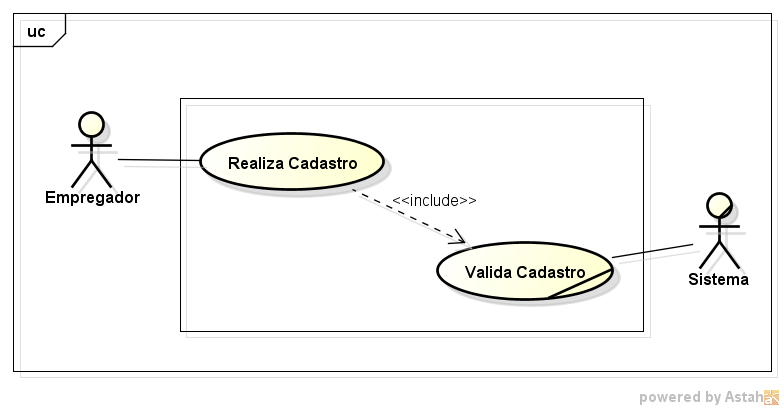

- **Objetivo**: registrar empregador e dados institucionais.
- **Ator principal**: Empregador.
- **Pré-condição**: não haver cadastro duplicado para os dados obrigatórios.
- **Fluxo principal**: preencher dados da conta/empresa -> validar -> concluir cadastro.
- **Pós-condição**: conta de empregador criada.

### Diagrama: Perfil do Empregador (visão simples)

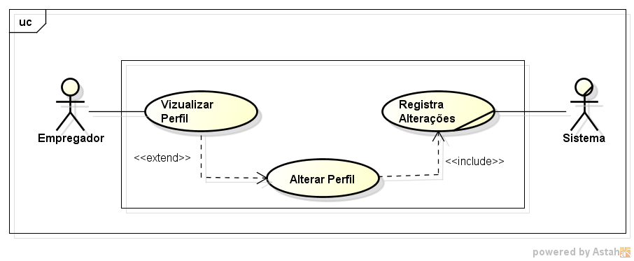

- **Objetivo**: visualizar e atualizar perfil institucional.
- **Ator principal**: Empregador.
- **Pré-condição**: empregador autenticado.
- **Fluxo principal**: acessar perfil -> editar dados -> salvar.
- **Pós-condição**: perfil institucional atualizado.

### Diagrama: Perfil do Empregador (visão complexa)

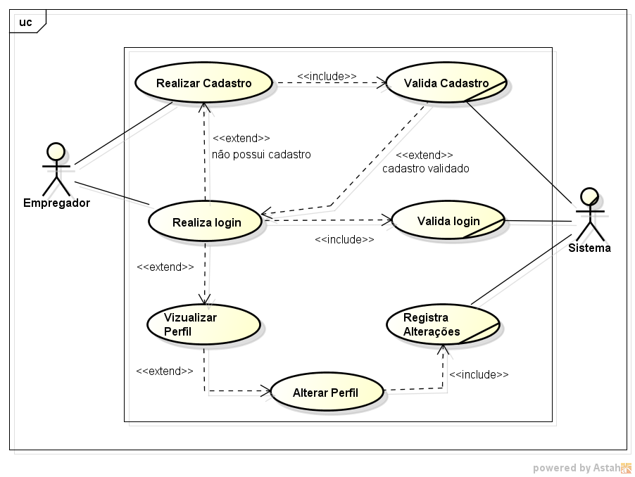

- **Objetivo**: detalhar o fluxo completo de gerenciamento do perfil com autenticação.
- **Ator principal**: Empregador.
- **Pré-condição**: login válido.
- **Fluxo principal**: login -> acesso ao perfil -> edição -> validação -> persistência.
- **Pós-condição**: dados institucionais consistentes e atualizados.

---

## RF04 — Pesquisar vagas, visualizar detalhes e candidatar-se

### Diagrama: Busca e Visualização de Vagas (visão simples)

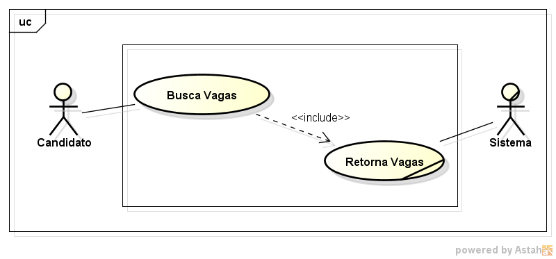

- **Objetivo**: permitir a busca/listagem de vagas.
- **Ator principal**: Candidato.
- **Pré-condição**: candidato com acesso à área de vagas.
- **Fluxo principal**: pesquisar vagas -> visualizar lista.
- **Pós-condição**: vagas exibidas para análise.

### Diagrama: Busca e Visualização de Vagas (visão complexa)

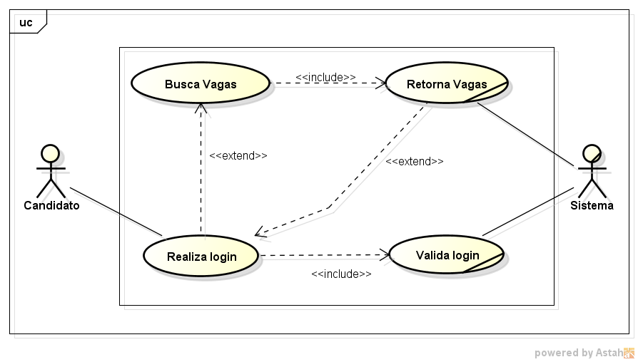

- **Objetivo**: detalhar login e navegação até a listagem de vagas.
- **Ator principal**: Candidato.
- **Pré-condição**: cadastro existente.
- **Fluxo principal**: login -> acessar vagas -> visualizar resultados.
- **Pós-condição**: candidato apto a selecionar vaga para candidatura.

### Diagrama: Candidatura a Vaga (visão simples)

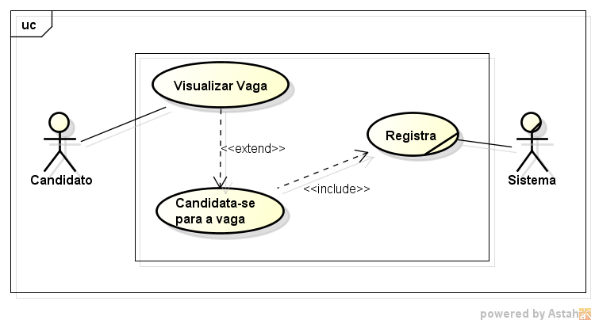

- **Objetivo**: registrar candidatura do candidato a uma vaga.
- **Ator principal**: Candidato.
- **Pré-condição**: vaga disponível para candidatura.
- **Fluxo principal**: abrir vaga -> acionar candidatura.
- **Pós-condição**: candidatura registrada com status inicial.

### Diagrama: Candidatura a Vaga (visão complexa)

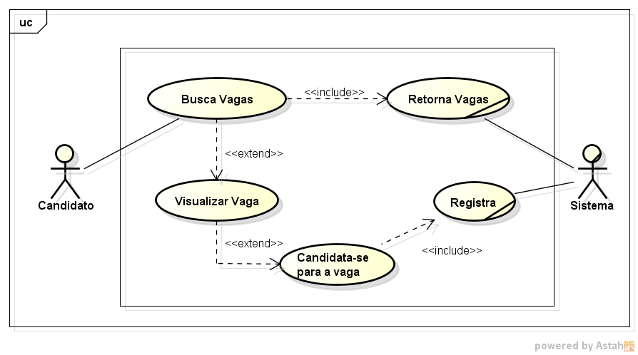

- **Objetivo**: demonstrar cadeia completa: login -> visualizar vaga -> candidatar.
- **Ator principal**: Candidato.
- **Pré-condição**: candidato autenticado.
- **Fluxo principal**: login -> visualizar detalhes -> confirmar candidatura.
- **Pós-condição**: candidatura vinculada ao candidato e à vaga.

---

## RF05 — Publicar vagas, visualizar candidatos e gerenciar status das candidaturas

### Diagrama: Gestão de Vagas

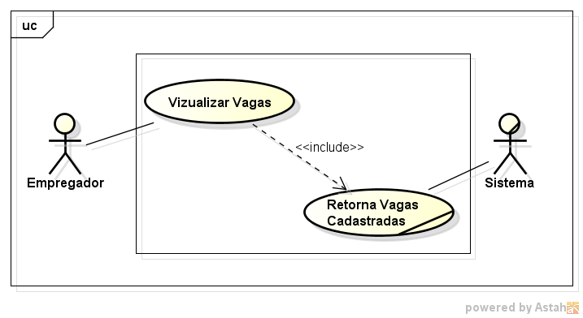

- **Objetivo**: acompanhar e gerenciar vagas publicadas.
- **Ator principal**: Empregador.
- **Pré-condição**: empregador autenticado e com vagas cadastradas.
- **Fluxo principal**: acessar vagas -> visualizar listagem.
- **Pós-condição**: visão consolidada das vagas do empregador.

### Diagrama: Visualização de Candidatos

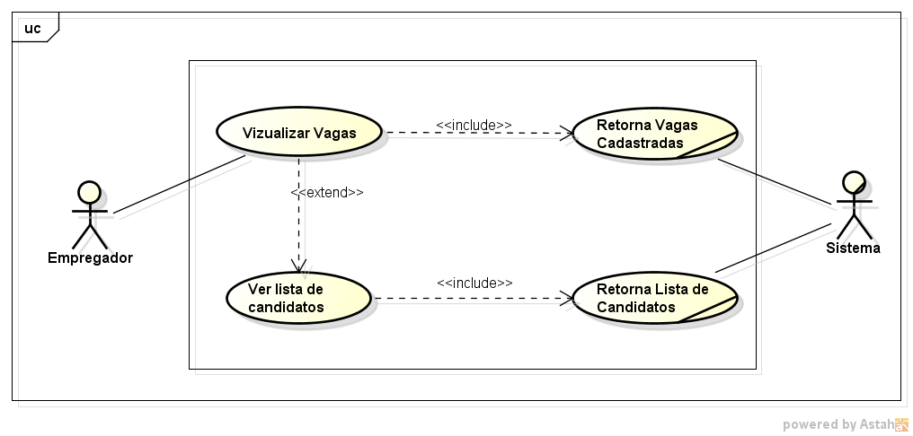

- **Objetivo**: listar candidatos inscritos em uma vaga.
- **Ator principal**: Empregador.
- **Pré-condição**: existência de candidaturas para a vaga selecionada.
- **Fluxo principal**: selecionar vaga -> visualizar candidatos.
- **Pós-condição**: candidatos disponíveis para análise.

### Diagrama: Perfil do Candidato (visão do empregador)

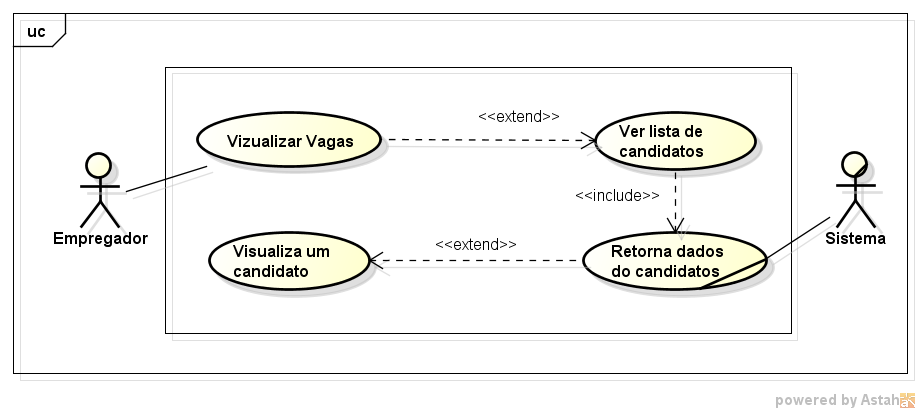

- **Objetivo**: analisar detalhes do candidato inscrito.
- **Ator principal**: Empregador.
- **Pré-condição**: candidato listado para a vaga.
- **Fluxo principal**: selecionar candidato -> abrir perfil.
- **Pós-condição**: decisão de triagem suportada por informações do perfil.

### Diagrama: Alterar status da candidatura (visão simples)

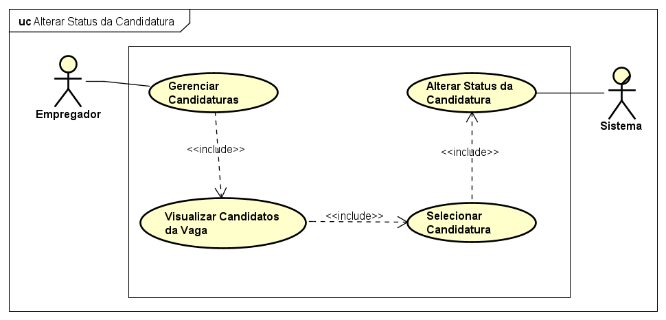

- **Objetivo**: alterar status da candidatura (ex.: Aceito/Rejeitado).
- **Ator principal**: Empregador.
- **Pré-condição**: candidatura existente e acessível ao empregador da vaga.
- **Fluxo principal**: selecionar candidatura -> alterar status -> salvar.
- **Pós-condição**: novo status registrado.

### Diagrama: Alterar status da candidatura (visão complexa)

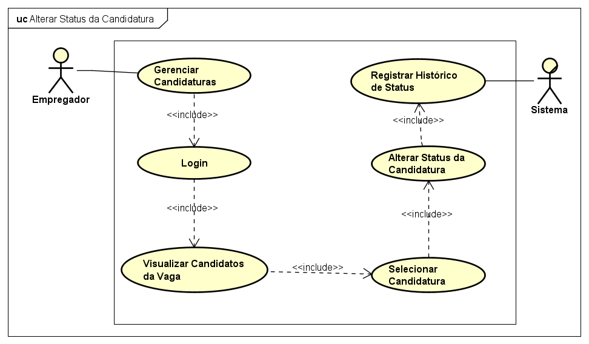

- **Objetivo**: detalhar o fluxo de autenticação e seleção até a atualização do status.
- **Ator principal**: Empregador.
- **Pré-condição**: login válido e permissão sobre a vaga.
- **Fluxo principal**: login -> selecionar vaga -> escolher candidatura -> atualizar status.
- **Pós-condição**: candidatura atualizada com rastreabilidade de decisão.

---

## RF06 — Filtrar vagas por área ou palavras-chave

### Diagrama: Filtrar vagas (visão simples)

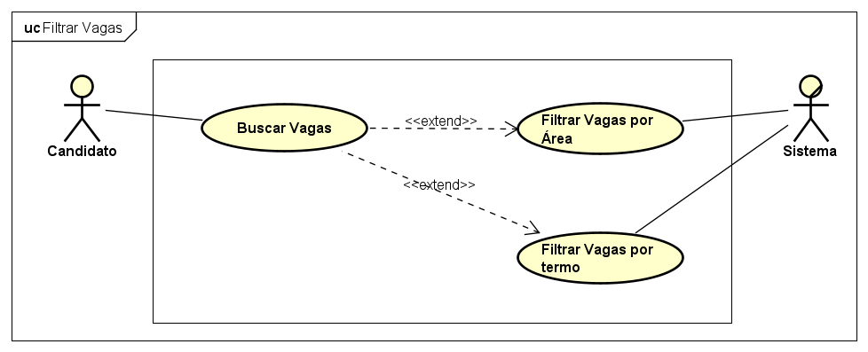

- **Objetivo**: refinar busca de vagas por critérios.
- **Ator principal**: Candidato.
- **Pré-condição**: disponibilidade de listagem de vagas.
- **Fluxo principal**: informar filtros -> aplicar.
- **Pós-condição**: lista filtrada exibida.

### Diagrama: Filtrar vagas (visão complexa)

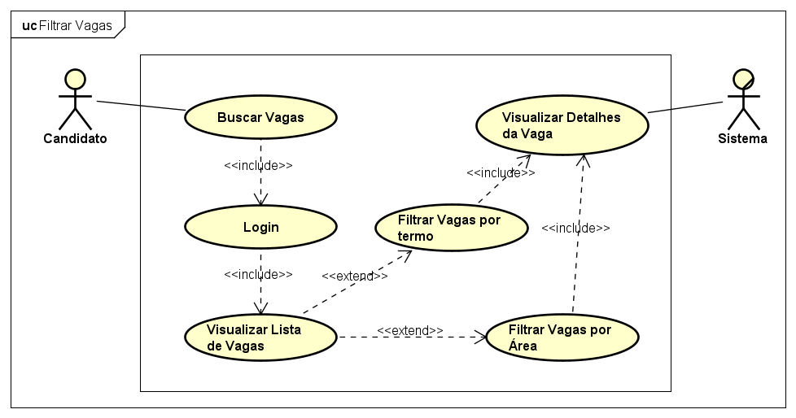

- **Objetivo**: detalhar filtros no contexto completo de navegação.
- **Ator principal**: Candidato.
- **Pré-condição**: login e acesso à busca de vagas.
- **Fluxo principal**: login -> abrir vagas -> definir filtros -> visualizar resultado.
- **Pós-condição**: vagas relevantes priorizadas para candidatura.

---

## RF07 — Filtrar e visualizar candidatos por critérios profissionais

### Diagrama: Filtrar candidatos (visão simples)

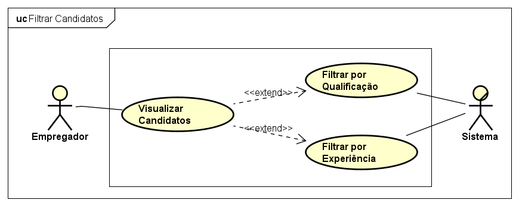

- **Objetivo**: filtrar candidatos por qualificação/experiência.
- **Ator principal**: Empregador.
- **Pré-condição**: lista de candidatos disponível.
- **Fluxo principal**: definir critérios -> aplicar filtros.
- **Pós-condição**: shortlist de candidatos exibida.

### Diagrama: Filtrar candidatos (visão complexa)

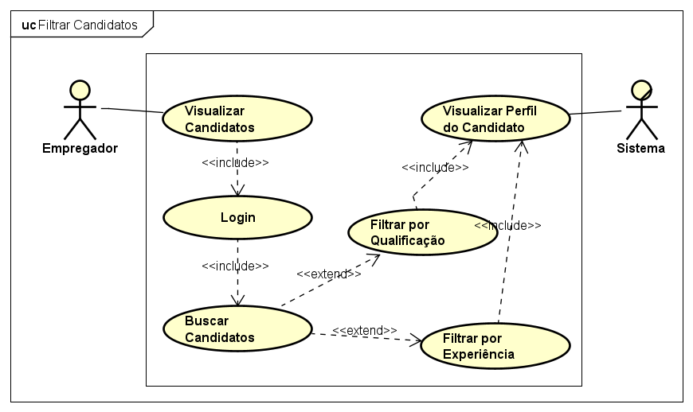

- **Objetivo**: detalhar filtragem combinada com contexto da vaga e análise de perfil.
- **Ator principal**: Empregador.
- **Pré-condição**: empregador autenticado e vaga selecionada.
- **Fluxo principal**: login -> selecionar vaga -> aplicar filtros -> analisar resultados.
- **Pós-condição**: candidatos priorizados para decisão.

---

## RF08 — Dashboard centralizado do empregador

### Diagrama: Acessar dashboard do empregador

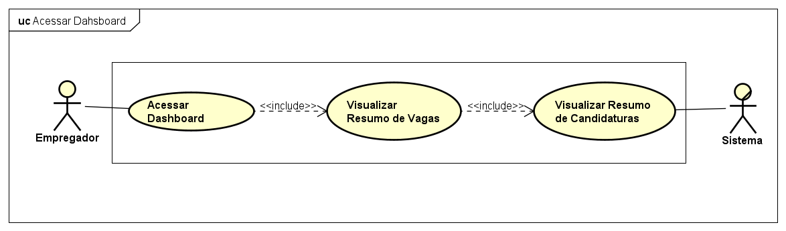

- **Objetivo**: centralizar gestão de vagas e candidatos em painel único.
- **Ator principal**: Empregador.
- **Pré-condição**: empregador autenticado.
- **Fluxo principal**: acessar dashboard -> visualizar indicadores e atalhos.
- **Pós-condição**: visão operacional consolidada para tomada de decisão.

---

## RF09 — Visualizar página pública da empresa e vagas ativas (Futuro)

### Diagrama a ser criado: Página pública da empresa

- **Objetivo sugerido**: permitir ao candidato visualizar informações institucionais e vagas ativas da empresa.
- **Ator principal**: Candidato (ou visitante).
- **Pré-condição sugerida**: empresa com perfil público habilitado.
- **Fluxo principal sugerido**: buscar empresa -> abrir página pública -> visualizar dados e vagas ativas.
- **Pós-condição sugerida**: candidato obtém contexto da empresa antes de candidatar-se.

---

## RF10 — Canal de suporte para dúvidas e problemas (Futuro)

### Diagrama a ser criado: Abrir solicitação de suporte

- **Objetivo sugerido**: registrar chamado de suporte técnico/funcional.
- **Ator principal**: Candidato ou Empregador.
- **Pré-condição sugerida**: usuário autenticado (ou fluxo anônimo, se definido em regra).
- **Fluxo principal sugerido**: acessar suporte -> descrever problema -> enviar solicitação -> receber protocolo.
- **Pós-condição sugerida**: solicitação registrada para atendimento.

---

## RF11 — Interação entre candidatos (Futuro)

### Diagrama a ser criado: Interação entre candidatos

- **Objetivo sugerido**: promover troca de experiências e informações profissionais.
- **Ator principal**: Candidato.
- **Pré-condição sugerida**: candidato autenticado e módulo de comunidade habilitado.
- **Fluxo principal sugerido**: acessar comunidade -> publicar/interagir -> visualizar respostas.
- **Pós-condição sugerida**: interação registrada e disponível para outros candidatos.
